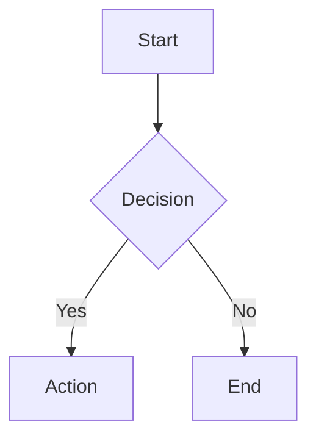
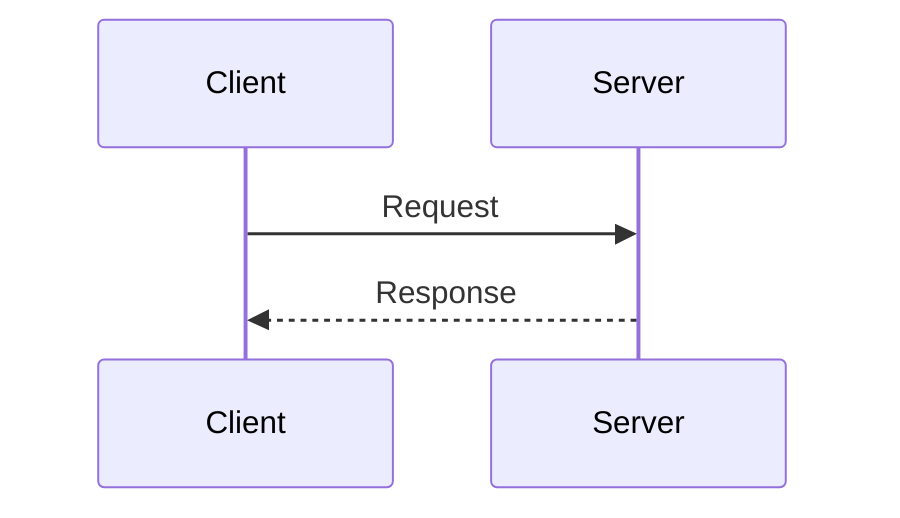
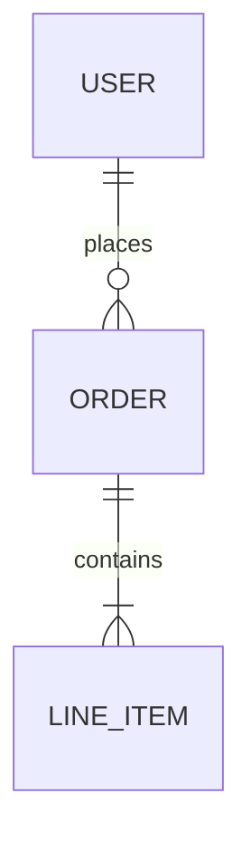

# Obsidian Markdown — Authoring Reference

## Frontmatter

Every note begins with a YAML block between triple-dashes. Required shape:

```yaml
---
date created: 2024-01-15T10:30:00
date modified: 2024-01-15T10:30:00
aliases: []
status: stub
---
```

- `status` values: `stub` · `stable` · `review` · `outdated`
- `aliases`: list of alternate names — plurals, abbreviations, alternate casings. Never duplicate the file name.
- Update `date modified` on every meaningful edit.
- No tags — taxonomy via folders + aliases only; preserve any `tags:` that already exist.

---

## Headings

```markdown
# H1 — note title (one per note, matches filename)
## H2
### H3
#### H4
##### H5
###### H6
```

---

## Emphasis & Inline Formatting

| Syntax | Renders as |
|--------|-----------|
| `**bold**` | **bold** |
| `*italic*` or `_italic_` | *italic* |
| `***bold italic***` | ***bold italic*** |
| `~~strikethrough~~` | ~~strikethrough~~ |
| `==highlight==` | ==highlight== |
| `` `inline code` `` | `inline code` |
| `$E = mc^2$` | inline LaTeX math |

---

## Links

### Wikilinks (internal)

```markdown
[[note-name]]                      # basic link
[[note-name|Display text]]         # aliased link
[[folder/note-name]]               # explicit path
[[note-name#Heading]]              # link to heading
[[note-name#^block-id]]            # link to block
```

### External links

```markdown
[Display text](https://example.com)
https://example.com                 # bare URL auto-links
```

---

## Embeds

```markdown
![[note-name]]                     # embed entire note
![[note-name#Heading]]             # embed note section
![[note-name#^block-id]]           # embed single block
![[image.png]]                     # embed local image
![[image.png|300]]                 # embed image with width
![[image.png|300x200]]             # embed image with dimensions
![[audio.mp3]]                     # embed audio
![[video.mp4]]                     # embed video
![[document.pdf]]                  # embed PDF
![[document.pdf#page=2]]           # embed PDF at page
```

---

## Code Blocks

### Fenced blocks — always specify the language

````markdown
```python
def greet(name: str) -> str:
    return f"Hello, {name}"
```
````

### Common language identifiers

`python` · `javascript` · `typescript` · `bash` · `shell` · `sql` · `yaml` · `json` · `html` · `css` · `markdown` · `mermaid` · `latex` · `rust` · `go` · `java` · `cpp` · `c`

### Inline code

```markdown
Use `git status` to check the working tree.
```

---

## Lists

### Unordered

```markdown
- item one
- item two
  - nested item
    - deeper
```

### Ordered

```markdown
1. first
2. second
   1. nested ordered
```

### Task lists

```markdown
- [ ] open task
- [x] completed task
- [/] in-progress (Obsidian renders a partial checkbox)
- [-] cancelled (Obsidian renders a strikethrough checkbox)
```

---

## Blockquotes

```markdown
> Single-level quote
>
> Multiple paragraphs in the same quote.

> Level 1
>> Level 2
>>> Level 3
```

---

## Horizontal Rule

```markdown
---
```

(Three or more dashes, asterisks, or underscores on their own line.)

---

## Tables

Standard GFM tables with optional column alignment:

```markdown
| Column A | Column B | Column C |
| :------- | :------: | -------: |
| left     | center   |    right |
| cell     | cell     |     cell |
```

- `:---` left-align · `:---:` center · `---:` right-align
- Surround with blank lines; avoid trailing spaces inside cells.

---

## Callouts

Callouts are block-level Obsidian constructs built on top of blockquotes.

### Syntax

```markdown
> [!type] Optional title
> Body text. Supports **all inline formatting** and nested content.
```

If the title is omitted, Obsidian uses the type name (capitalised) as the default.

### Foldable callouts

```markdown
> [!type]+ Expanded by default (+ keeps it open)
> Body...

> [!type]- Collapsed by default (- closes it)
> Body...
```

### Supported types

| Type | Aliases | Use for |
|------|---------|---------|
| `note` | — | General observations |
| `abstract` | `summary`, `tldr` | Summaries, TLDR |
| `info` | — | Informational notes |
| `todo` | — | Action items |
| `tip` | `hint`, `important` | Tips, best practices |
| `success` | `check`, `done` | Completed items, confirmations |
| `question` | `help`, `faq` | Open questions, FAQs |
| `warning` | `caution`, `attention` | Warnings, caveats |
| `failure` | `fail`, `missing` | Failures, missing items |
| `danger` | `error` | Critical errors, dangerous actions |
| `bug` | — | Known bugs |
| `example` | — | Examples, demos |
| `quote` | `cite` | Quotations, citations |

### Examples

```markdown
> [!tip] Pro tip
> Use `Cmd+P` to open the command palette.

> [!warning]- Gotcha (collapsed)
> This setting affects all vaults, not just the current one.

> [!example]
> No title needed — type name renders as title.
```

### Nested callouts

```markdown
> [!info] Outer
> Some context.
>
> > [!tip] Inner
> > A tip nested inside info.
```

---

## Math (MathJax / LaTeX)

### Inline math

```markdown
The formula is $E = mc^2$ where $c \approx 3 \times 10^8\ \text{m/s}$.
```

### Block math

```markdown
$$
\int_{-\infty}^{\infty} e^{-x^2}\,dx = \sqrt{\pi}
$$
```

```markdown
$$
\begin{pmatrix}
a & b \\
c & d
\end{pmatrix}
\begin{pmatrix}
x \\ y
\end{pmatrix}
=
\begin{pmatrix}
ax + by \\ cx + dy
\end{pmatrix}
$$
```

---

## Mermaid Diagrams

````markdown

````

````markdown

````

````markdown

````

Supported diagram types: `graph` / `flowchart` · `sequenceDiagram` · `classDiagram` · `stateDiagram-v2` · `erDiagram` · `gantt` · `pie` · `journey` · `gitGraph` · `mindmap` · `timeline`

---

## Footnotes

```markdown
This claim needs a source.[^1]

[^1]: The source text goes here, at the bottom of the note.
```

Inline footnote (no reference needed):

```markdown
Another approach^[Inline footnote text directly here.] is also valid.
```

---

## Comments

Obsidian comments — hidden in reading view, visible in source:

```markdown
%% This is a hidden comment. %%

%%
Multi-line comment.
Not rendered at all.
%%
```

HTML comments also work but prefer `%%`:

```html
<!-- HTML comment — visible in exported HTML -->
```

---

## Block IDs

Append a block ID to make a block linkable and embeddable:

```markdown
This paragraph is a specific block. ^my-block-id

- List item ^list-item-id
```

Then link to it from anywhere: `[[note-name#^my-block-id]]`

---

## Supported HTML

Obsidian renders a subset of HTML inline. Use sparingly — prefer native Obsidian syntax.

### Useful elements

```html
<!-- Line break inside a table cell or paragraph -->
<br>

<!-- Superscript / subscript -->
H<sub>2</sub>O       &nbsp; CO<sub>2</sub>
E = mc<sup>2</sup>

<!-- Definition lists (renders in reading view) -->
<dl>
  <dt>Term</dt>
  <dd>Definition</dd>
</dl>

<!-- Keyboard keys -->
Press <kbd>Cmd</kbd> + <kbd>P</kbd>

<!-- Abbreviations with tooltip -->
<abbr title="Artificial Intelligence">AI</abbr>

<!-- Coloured / styled text (use sparingly) -->
<span style="color: var(--color-red)">Warning text</span>
<span style="color: var(--color-green)">Success text</span>

<!-- Small / fine print -->
<small>Disclaimer text here.</small>

<!-- Details / summary (collapsible, non-callout) -->
<details>
<summary>Click to expand</summary>

Content inside — supports Markdown when separated by blank lines.

</details>

<!-- Centred content -->
<div style="text-align: center">

![[image.png|200]]

</div>
```

### CSS variables for theme-compatible colours

| Variable | Semantic |
|----------|----------|
| `--color-red` | Error / danger |
| `--color-orange` | Warning |
| `--color-yellow` | Caution / highlight |
| `--color-green` | Success |
| `--color-blue` | Info |
| `--color-purple` | Special |
| `--text-accent` | Accent colour (theme-defined) |
| `--text-muted` | De-emphasised text |

---

## Formatting Rules & Anti-Patterns

- **One H1 per note** — it is the note title. Never add a second `#` heading.
- **Blank line before and after** block elements: headings, code blocks, callouts, tables, math blocks, horizontal rules.
- **No trailing spaces** — they cause unintended line breaks.
- **Wikilinks over external links** for all internal navigation — they show up in graph view and backlinks.
- **Language on every code block** — unlocks syntax highlighting; never use a bare ` ``` `.
- **Callouts over custom HTML** for structured annotations — they are theme-aware and mobile-safe.
- **Prefer `%%...%%` over HTML comments** — not exported and cleaner in Live Preview.
- **Avoid raw HTML for layout** unless the native syntax cannot express it.
- **Dataview blocks** (`dataview`, `dataviewjs`) must be preserved verbatim; never alter their queries.
